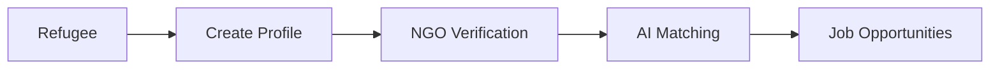
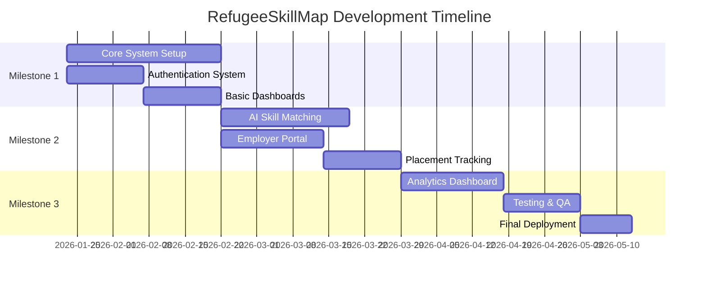

<div align="center">

# RefugeeSkillMap

### *Beyond Shelter: Mapping Skills to Sustainable Livelihoods*

[](https://www.figma.com/make/C3ybGvEwfawZjC6KTOSUdo/RefugeeSkillMap-Web-Application-UI?p=f&t=xxMgFypa39U9B45a-0)
[](https://reactjs.org/)
[](https://laravel.com/)
[](https://www.mysql.com/)

**Empowering refugees with verified skill profiles to access ethical employment, training, and dignified opportunities — without official documents.**

[View Live Demo](#) • [Figma Design](https://www.figma.com/make/C3ybGvEwfawZjC6KTOSUdo/RefugeeSkillMap-Web-Application-UI?p=f&t=xxMgFypa39U9B45a-0) • [Documentation](#)

</div>

---

## Team Members

<table>
<tr>
<td align="center">
<strong>Syed Mohammed Sazid Ullah</strong><br>
<sub>Lead & Full Stack Developer</sub><br>
<code>20230104062</code><br>
sazid.cse.20230104062@aust.edu
</td>
<td align="center">
<strong>Abrar Ahmed Cy</strong><br>
<sub>Frontend Developer</sub><br>
<code>20230104063</code><br>
abrar.cse.20230104063@aust.edu
</td>
</tr>
<tr>
<td align="center">
<strong>Irfan Zahir</strong><br>
<sub>Backend Developer</sub><br>
<code>20230104064</code><br>
irfan.cse.20230104064@aust.edu
</td>
<td align="center">
<strong>Md Tawsif Bin Mannan</strong><br>
<sub>Backend Developer</sub><br>
<code>20230104066</code><br>
towsif.cse.20230104066@aust.edu
</td>
</tr>
</table>

---

## Project Overview

### Objective

**RefugeeSkillMap** is an **impact-first digital platform** that enables refugees and displaced people to create **portable, NGO-verified digital skill profiles** without relying on official documents. The system connects verified refugees to ethical jobs, training, and apprenticeships using **AI-powered skill matching**, while ensuring privacy, dignity, and measurable social impact.

<div align="center">

### Aligned with UN Sustainable Development Goals


</div>

### Target Audience

<table>
<tr>
<td align="center"><strong>Refugees</strong><br><sub>Seeking dignified employment</sub></td>
<td align="center"><strong>NGO Workers</strong><br><sub>Managing verifications</sub></td>
<td align="center"><strong>Employers</strong><br><sub>Ethical hiring opportunities</sub></td>
<td align="center"><strong>Donors</strong><br><sub>Monitoring impact</sub></td>
</tr>
</table>

---

## Tech Stack

<div align="center">

### Frontend


### Backend


### Database


### AI & Tools


### Deployment


</div>

---

## Project Features

### Core Features



<table>
<tr>
<td width="50%">

#### For Refugees
- Profile creation without documents
- Skill portfolio management
- Personalized job recommendations
- Multi-language support

</td>
<td width="50%">

#### For NGO Workers
- Skill verification system
- Case management tools
- Placement tracking
- Impact reporting

</td>
</tr>
<tr>
<td>

#### For Employers
- Access verified talent pool
- Job posting interface
- Feedback system
- Ethical hiring safeguards

</td>
<td>

#### For Admins
- User management
- Organization oversight
- Analytics dashboard
- Audit logs

</td>
</tr>
</table>

### AI-Powered Intelligence

> **Powered by Gemini AI Flash**

- **Smart Skill Matching** - AI-driven job and training recommendations
- **Impact Analytics** - Real-time visualization of social impact metrics
- **Intelligent Search** - Natural language job discovery
- **Training Suggestions** - Personalized upskilling pathways

> **Ethical AI Usage**: AI features support matching and analysis only — never making legal or employment decisions.

### CRUD Operations

| Role | Create | Read | Update | Delete |
|------|--------|------|--------|--------|
| **Refugees** | Yes | Yes | Yes | No |
| **NGOs** | Yes | Yes | Yes | Yes |
| **Employers** | Yes | Yes | Yes | Yes |
| **Admins** | Yes | Yes | Yes | Yes |

---🌟 Conclusion

<div align="center">

**RefugeeSkillMap** transforms undocumented refugee skills into verified opportunities, enabling:

🎯 **Dignified Employment** • 💪 **Reduced Aid Dependency** • 📊 **Measurable Social Impact**

By combining ethical design, AI-powered matching, and NGO-driven trust, we demonstrate how technology can support **sustainable livelihoods beyond humanitarian shelter**.

---

### 🤝 Contributing

We welcome contributions! Please see our [Contributing Guidelines](CONTRIBUTING.md) for details.

### License

This project is licensed under the MIT License - see the [LICENSE](LICENSE) file for details.

### Contact

For questions or collaboration opportunities, reach out to the team lead:
- **Email**: sazid.cse.20230104062@aust.edu
- **Figma**: [View Design System](https://www.figma.com/make/C3ybGvEwfawZjC6KTOSUdo/RefugeeSkillMap-Web-Application-UI?p=f&t=xxMgFypa39U9B45a-0)

---

<sub>Built with care for refugees worldwide | © 2026 RefugeeSkillMap Team</sub>

</div> RESTful Endpoints

```http
# Authentication
POST   /api/auth/login                    # User authentication
POST   /api/auth/register                 # New user registration
POST   /api/auth/logout                   # User logout

# Refugee Operations
POST   /api/refugees/profile              # Create skill profile
GET    /api/refugees/opportunities        # Fetch matching jobs
PUT    /api/refugees/profile/{id}         # Update profile

# NGO Operations
POST   /api/ngo/verify/{refugee_id}       # Verify refugee skills
GET    /api/ngo/cases                     # View assigned cases
POST   /api/ngo/placement                 # Record placement

# Employer Operations
GET    /api/employer/talent               # Browse verified talent
POST   /api/employer/jobs                 # Post new job
PUT    /api/employer/jobs/{id}            # Update job listing

# Admin Operations
GET    /api/admin/impact-metrics          # System-wide analytics
GET    /api/admin/users                   # User management
POST   /api/admin/audit                   # Generate audit report
```

---

## Project Phases

<table>
<tr>
<td align="center" width="33%">

### Phase 1
**Frontend Development**

- UI/UX Design
- React Dashboards
- Role-based Routing
- Responsive Layouts

</td>
<td align="center" width="33%">

### Phase 2
**Backend & Database**

- Laravel API Development
- MySQL Schema
- AI Integration
- JWT Authentication

</td>
<td align="center" width="33%">

### Phase 3
**Deployment & Testing**

- Cloud Deployment
- Security Testing
- Integration Testing
- Performance Optimization

</td>
</tr>
</table>

---

## Milestones & Timeline



### Milestone 1: Core System Setup
- User roles and authentication
- Refugee profile system
- NGO verification workflow
- Basic dashboard interfaces

### Milestone 2: Matching & Placement
- AI-powered skill matching engine
- Employer onboarding and job posting
- Placement tracking and analytics
- Notification system

### Milestone 3: Impact & Finalization
- Analytics dashboards
- SDG-aligned reporting
- Security auditing
- Testing, optimization, and deployment

---

## Conclusion

**RefugeeSkillMap** transforms undocumented refugee skills into verified opportunities, enabling dignified employment, reduced aid dependency, and measurable social impact. By combining ethical design, AI-powered matching, and NGO-driven trust, the platform demonstrates how technology can support sustainable livelihoods beyond humanitarian shelter.

---
